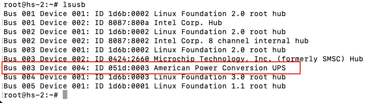
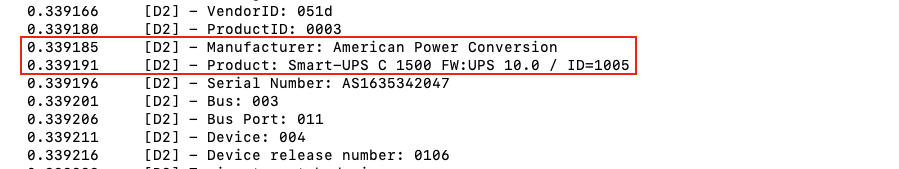
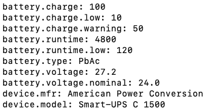
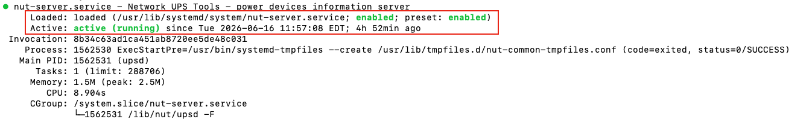
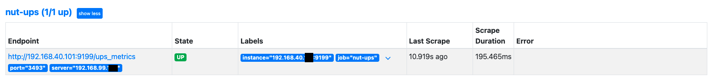
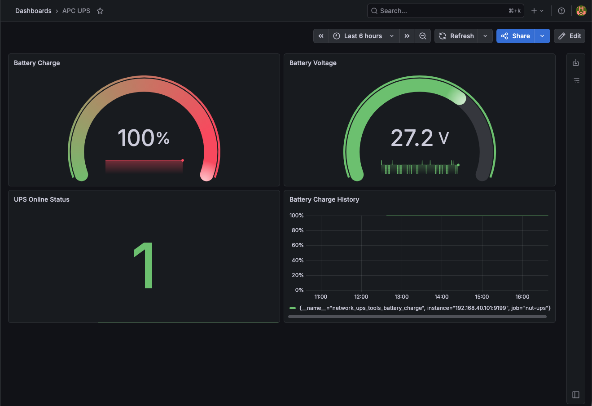

# APC Smart-UPS C1500 Monitoring with Network UPS Tools (NUT) on Proxmox

## Overview

This project demonstrates the deployment and configuration of Network UPS Tools (NUT) on a Proxmox VE host to monitor and manage an APC Smart-UPS C1500 over USB.

The solution provides real-time UPS monitoring, battery health visibility, runtime tracking, and lays the foundation for automated graceful shutdown procedures during power outages.

---

## Objective

Implement centralized UPS monitoring on a Proxmox host to improve infrastructure resiliency and business continuity during utility power failures.

---

## Environment

| Component | Details |
|-----------|---------|
| Hypervisor | Proxmox VE 8 |
| Hostname | hs-2 |
| UPS Model | APC Smart-UPS C1500 |
| Connection Type | USB HID |
| Monitoring Software | Network UPS Tools (NUT) |
| Driver | usbhid-ups |
| Operating System | Debian Linux (Proxmox Base) |

---

## Business Scenario

A homelab environment hosting infrastructure services required protection from unexpected power outages.

The APC Smart-UPS C1500 was connected to the Proxmox host to provide battery backup power and allow the host to monitor UPS status, battery charge, and runtime information.

The goal was to establish reliable UPS monitoring and prepare for future implementation of automated VM and host shutdown procedures during extended power loss events.

---

## Initial Issue

After installation, NUT was unable to communicate with the UPS and returned the following error:

```bash
Error: Driver not connected
```

Additional troubleshooting revealed:

```bash
libusb1: Could not open any HID devices
```

Although Linux detected the UPS successfully through USB, the NUT driver was not communicating properly.

---

## Troubleshooting Process

### Verify USB Detection

Confirmed that the operating system detected the UPS.

```bash
lsusb
```

Output:

```text
Bus 003 Device 003: ID 051d:0003 American Power Conversion UPS
```

---

### Verify Driver Configuration

Configured the UPS definition in:

```bash
/etc/nut/ups.conf
```

Configuration:

```ini
[apc]
driver = usbhid-ups
port = auto
desc = "APC C1500"
pollonly = yes
```

---

### Manual Driver Testing

Executed the UPS driver in debug mode to validate communication.

```bash
/usr/lib/nut/usbhid-ups -DD -u root -a apc
```

Successful detection:

```text
Detected a UPS: American Power Conversion
Smart-UPS C 1500
```

This confirmed that the USB communication path and UPS hardware were functioning correctly.

---

### Restart Services

```bash
upsdrvctl stop
upsdrvctl start

systemctl restart nut-server
systemctl restart nut-monitor
```

---

## Verification

Successfully queried the UPS using:

```bash
upsc apc
```

Sample output:

```text
battery.charge: 100
battery.runtime: 4500
device.model: Smart-UPS C 1500
ups.status: OL
```

---

## Status Definitions

| Status | Meaning |
|---------|---------|
| OL | On Line (Utility Power Available) |
| OB | On Battery |
| LB | Low Battery |
| RB | Replace Battery |

---

## Services Verified

### NUT Server

```bash
systemctl status nut-server
```

Result:

```text
Active: active (running)
```

### NUT Monitor

```bash
systemctl status nut-monitor
```

Result:

```text
Active: active (running)
```

---

## Current Capabilities

- UPS Battery Monitoring
- Runtime Monitoring
- Input Power Status Monitoring
- Battery Health Visibility
- Proxmox Host Integration
- NUT Service Monitoring

---

## Future Enhancements

### Planned Improvements

- Automatic Proxmox Host Shutdown During Extended Power Loss
- Graceful VM Shutdown Integration
- Email Alerting
- Microsoft Teams Notifications
- Home Assistant Integration
- UPS Runtime Trend Analysis
- Multi-UPS Monitoring
- Battery Health Alerting
  
---

## Architecture

```text
APC Smart-UPS C1500
        |
        | USB
        v
hs-2 Proxmox Host
Network UPS Tools (NUT)
        |
        | TCP 3493
        v
docker01
NUT Exporter
        |
        | HTTP 9199
        v
Prometheus
        |
        v
Grafana Dashboard
```

---

## Prometheus and Grafana Integration

### NUT Exporter

A NUT Exporter container was deployed on `docker01` to expose NUT metrics to Prometheus.

Exporter test:

```bash
curl "http://localhost:9199/ups_metrics?server=192.168.99.XXX&port=3493"
```

Example metrics:

```text
network_ups_tools_battery_charge 100
network_ups_tools_battery_voltage 27.2
network_ups_tools_ups_status{flag="OL"} 1
```

### Prometheus Configuration

```yaml
- job_name: 'nut-ups'
  metrics_path: /ups_metrics
  params:
    server: ['192.168.99.xxx']
    port: ['3493']
  static_configs:
    - targets: ['192.168.40.xxx:9199']
```

### Verification

Prometheus successfully scraped UPS metrics:

```text
nut-ups (1/1 up)
State: UP
```

### Useful PromQL Queries

```promql
network_ups_tools_battery_charge
```

```promql
network_ups_tools_battery_voltage
```

```promql
network_ups_tools_ups_status{flag="OL"}
```

```promql
network_ups_tools_ups_status{flag="OB"}
```
---

## Skills Demonstrated

### Infrastructure

- Proxmox Administration
- Linux System Administration
- Service Management (systemd)
- Hardware Monitoring

### Power Management

- UPS Deployment
- Battery Monitoring
- Business Continuity Planning
- Infrastructure Resiliency

### Troubleshooting

- USB Device Diagnostics
- Linux Driver Troubleshooting
- Service Debugging
- Root Cause Analysis

### Monitoring and Observability

- Network UPS Tools (NUT)
- Prometheus
- Grafana
- Metrics Collection
- Infrastructure Monitoring
- Dashboard Creation

---

## Outcome

Successfully deployed and configured Network UPS Tools (NUT) on a Proxmox host to monitor an APC Smart-UPS C1500.

The UPS is fully operational and reporting real-time battery status, runtime information, and power conditions, providing a foundation for future automated shutdown and alerting workflows.

---

## Screenshots

### UPS Detection



### Driver Detection



### UPS Status Output



### NUT Service Status



### Prometheus Target



### Grafana Dashboard



---

## Author

**Ricardo Cardenas**

IT Support Associate | CompTIA Security+ Certified | Homelab Enthusiast

Building hands-on experience in Systems Administration, Identity & Access Management (IAM), Infrastructure Monitoring, and Cybersecurity through real-world projects and enterprise-focused homelab environments.
